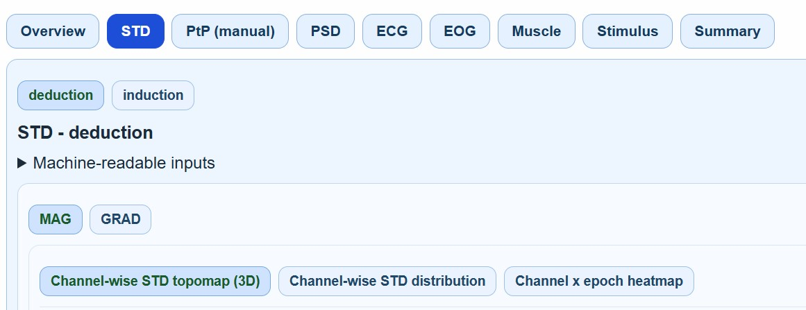

# HTML Reports Overview

MEGqc produces interactive HTML reports. Figures are "lazy-rendered", only the active tab's content is rendered, this keep large reports responsive and avoid lagging. The reports can be generated at four scopes. In the following sections we will cover each of them:

1. **[QA Subject reports](../report/qa_subject.md)** (per subject)
2. **[QA Group reports](../report/qa_group.md)** (per dataset)
3. **[QC Group reports](../report/qc_group.md)** (per dataset, Global Quality Index centered)
4. **[Multisample reports](../report/multisample.md)** (cross-dataset comparison): it can be either for QA or QC.


```{admonition} Report Overview
:class: tip
This section explains report structure and interpretation. For run commands and GUI clicks, use the [Tutorial](./tutorial.md).
```

<br>

All reports are structured in a _"nested-tab-hierarchy"_.

| Hierarchy level | Content                                                                                |
|---|----------------------------------------------------------------------------------------|
| Level 1 | Top tabs: `Overview`, metrics (`STD`, `PtP`, `PSD`, `ECG`, `EOG`...), `Summary` tab... |
| Level 2 | Task subtabs _(e.g., deduction and induction)_                                         |
| Level 3 | Channel-type subtabs: `MAG`, `GRAD`, `General`                                         |
| Level 4 | Plot subtabs: metric-specific visualizations _(e.g., Channel-wise STD topomap (3D))_   |





```{admonition} Next pages

In the next subsections we'll go through the 4 different scopes of reports (subject QA, group QA & QC and multisample), and within each, every metric and how their different visualizations can be interpreted.

```


<!--

## Top Tabs
Most of reports have the following `tabs`, they will be explained within each type of report.

* **Overview**: This section summarizes key recording metadata such as recording duration and sampling properties, basic acquisition/filter information, channel inventory and modality metadata.
* **Standard Deviation (STD)**: This metric shows different views on channel variability, which allows you to identify noisy and flat channels.
* **Peak-to-Peak (PtP)**: This metric shows different excursion amplitude views, to locate transient bursts and outlier excursions.
* **Power Spectral Density (PSD)**: This metric helps to identify band-dominance patterns such as line noise.
* **Electrocardiogram (ECG)**: This metric shows cardiac contamination on the signal.
* **Electrooculography (EOG)**: This metric shows ocular contamination on the signal with physiological coupling views.
* **Muscle**: This metric shows high-frequency burden, linked to muscle artifacts over time.
* **Head**: Movement summaries, if cHPI is available. This metric helps to evaluate motion-related quality degradation.
* **Stimulus**: It shows the event/stim channel structure. Helps to evaluate the epoching validaity and trigger integrity.
* **Summary**: It includes a summary of the key findings from every metric. 


- [Basic information and report header](../report/metrics/basic.md)
- [STD](../report/metrics/std.md)
- [PtP](../report/metrics/ptp.md)
- [PSD](../report/metrics/psd.md)
- [ECG](../report/metrics/ecg.md)
- [EOG](../report/metrics/eog.md)
- [Muscle](../report/metrics/muscle.md)
- [Head](../report/metrics/head.md)
- [Stimulus](../report/metrics/stim.md)

## Report Matrix
| Report scope | Input derivatives | Main question answered | Typical output location | Primary audience |
|---|---|---|---|---|
| QA Subject | `calculation/sub-*/...` + per-run summary JSON | What is the full quality profile of one subject across runs/tasks? | `reports/sub-*_meg.html` | Data curator, analyst |
| QA Group | `calculation/` for one dataset | What are cohort-level quality patterns and task-dependent shifts? | `reports/group_QA_report.html` | Lab lead, cohort curator |
| QC Group | `summary_reports/group_metrics/Global_Quality_Index_attempt_<n>.tsv` | How do QC indicators and GQI rank recordings/subjects? | `reports/group_QC_report.html` | QC operator, triage workflows |
| QA/QC Multisample | multiple datasets (QA: `calculation/`; QC: GQI TSV attempts) | How do quality and QC profiles compare across datasets/systems/sites? | `reports/multisample_*.html` | Consortium harmonization |


## Subject report tab map

| Subject tab | Core content | Main interpretation target |
|---|---|---|
| Overview | run/metric availability, raw header metadata, sensor geometry | confirm data completeness and context before metric interpretation |
| STD | channel variability views (space/distribution/channel×epoch) | noisy/flat channels and non-stationary variance |
| PtP (manual/auto) | excursion amplitude views | transient bursts and outlier excursions |
| PSD | spectral burden views | mains/interference and band-dominance patterns |
| ECG / EOG | physiological coupling views | cardiac/ocular contamination burden |
| Muscle | high-frequency burden and event load | muscle artifacts over time |
| Head | movement summaries (if cHPI available) | motion-related quality degradation |
| Stimulus | event/stim channel structure | epoching validity and trigger integrity |
| QC summary | metric-specific QC tables + GQI attempts | auditable QC footprint per run/task |


-->
