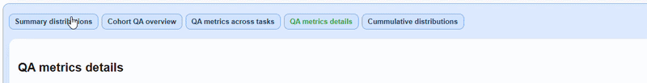
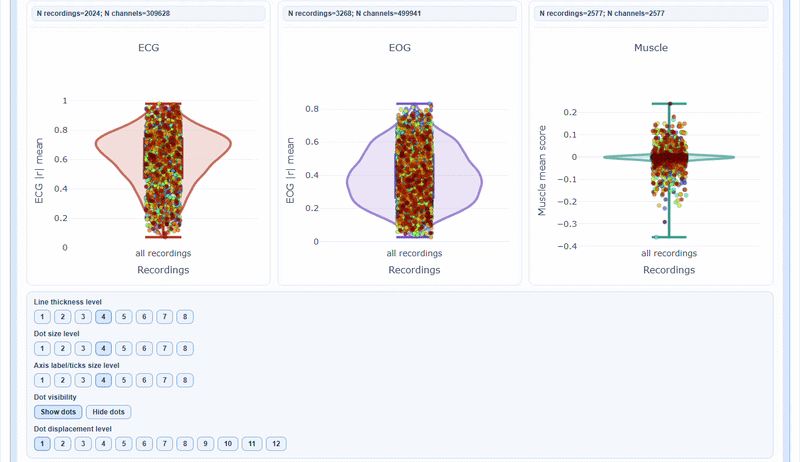
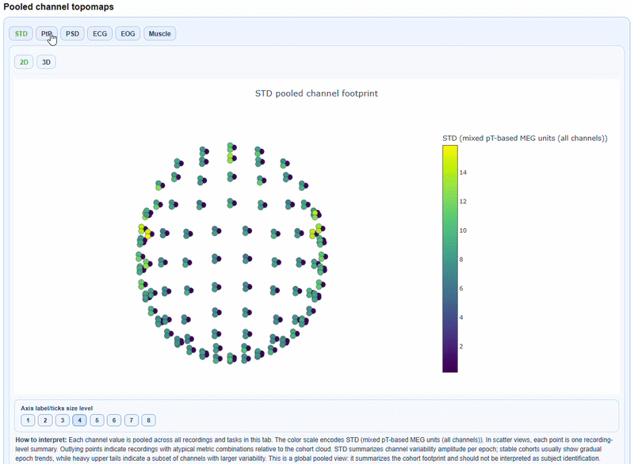
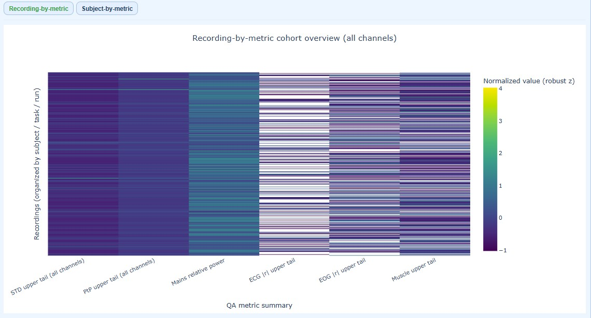
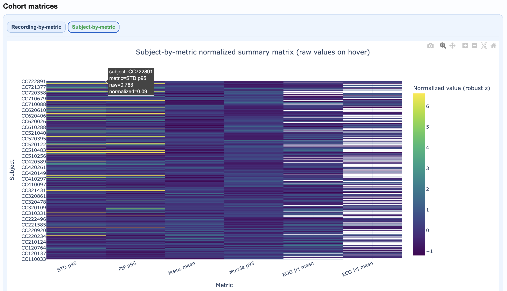
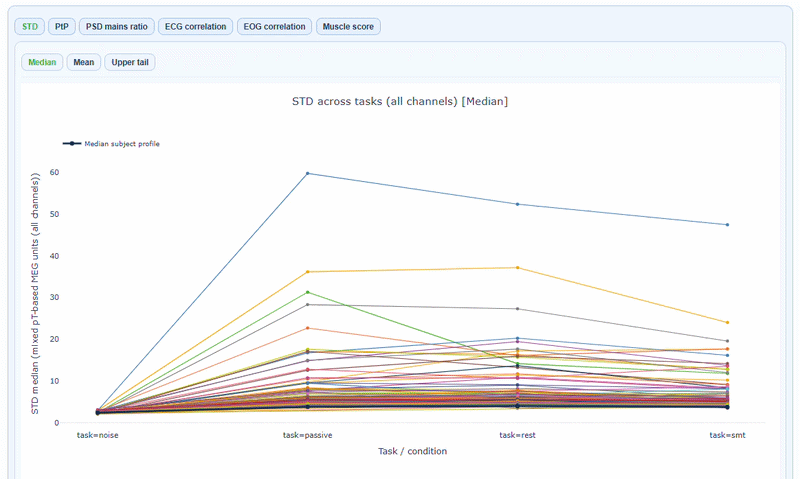

# QA Group Report

QA Group reports aggregate quality assessment metrics across all subjects in a single dataset. They help identify cohort-level patterns, outliers, and task-dependent quality shifts. 

This section explains report structure and interpretation. For run commands and GUI clicks, use the [Tutorial](./tutorial.md). 

The QA Group report uses a main two-level tab hierarchy and more optional:

| Hierarchy level | Content                                                                              |
|-----------------|--------------------------------------------------------------------------------------|
| Level 1         | Channel-type tabs: `Combined (MAG+GRAD)`, `MAG`, `GRAD`                              |
| Level 2         | Section subtabs (see below)                                                          |
| Level 3         | (Only for metrics) Metrics subtabs: `STD`, `PtP`, `PSD`...                           |
| Level 4+        | (Specific cases) measures (`Median`, `Mean`...) and figures (`Boxplot`, `Violin`...) |

## Header

The header of the report shows you a snapshot of the settings used for your QA group report. This is useful for documentation and reproducibility purposes, as you can always check which parameters were used to generate the report. Then, you can choose to show or hide the grids for all visualizations as well as the channel types. 


```{dropdown} Channel-types

- `MAG`: Magnetomere-specific analysis (units:pT)
- `GRAD`: Gradiometer-specific analysis (units:pT/cm)
- `General`: Pooled view across all channel types (use with caution due to unit mixing)

```




## Section 1: Summary Distributions

This section provides quick statistical overviews of each metric across all recordings. 

- **Violin plots:** Show full distribution shape for each metric
- **Box plots:** Highlight median, quartiles, and outliers
- **Individual points:** Each recording plotted for identification


As with many other figures, you can hover over individual points to see the subject/recording ID and exact metric value. You can also modify many visibility aspects such as the thickness of the violin and boxplot lines, the size of the individual points, the axis label and ticks fontsize and the displacement of the individual points to avoid overlap with the background elements.



### Pooled channel topomaps

You can see a `2D topomap` or a `3D topomap` of each metric averaged across all recordings and channels. This gives a quick overview of where quality issues tend to concentrate across the cohort. The `3D topomap` also has a `Cap on` mode to add a solid cap for improved visualization. 





<!--


**How to interpret:**
- Wide distributions suggest high variability across recordings
- Outlier points above/below whiskers may need individual inspection
- Compare MAG vs GRAD tabs for sensor-type-specific patterns
-->

## Section 2: Cohort QA Overview

This section provides information regarding subjects' quality footprint across all metrics. It includes ranking, heatmap and epoch data.


### Subject Ranking Table
This table shows all subjects ranked by aggregated quality footprint. The higher the rank, the more quality issues that subject has across all metrics. This is a useful starting point to identify which subjects may need closer inspection in the QA Subject reports.


### Cohort matrices

Two complementary heatmaps help you understand quality patterns at different levels of detail. As in other figures, you can hover over individual cells to see the subject/recording ID and exact metric value. You can also modify many visibility aspects such as the  axis label and ticks fontsize.

````{tab-set}
```{tab-item} Recording-by-Metric (Heatmap) 
Shows **every individual recording**, organized by subject/task/run. It identifies which specific recordings are problematic within a subject.
- **Rows** = each individual recording (multiple rows per subject if they have multiple runs)
- **Columns** = upper trail of every metric (STD, PtP, PSD, etc.)
- **Color** = normalized burden across metrics (lighter = higher burden)




```

```{tab-item} Subject-by-Metric (Heatmap)
Shows **aggregated metrics per subject**, pooling all their recordings. It identifies which subjects are generally problematic across all their data, regardless of how many recordings they have.

- **Rows** = each subject (one row per subject, regardless of how many recordings they have)
- **Columns** = metric summaries (STD, PtP, PSD, etc.)
- **Color** = normalized burden per metric (allows cross-metric comparison; lighter = higher burden)




```
````


### Top Subject Epoch Profiles

This section visualizes epoch-wise quality patterns for the highest-burden subjects, helping you identify **temporal trends** within individual subjects. Each panel represents one subject, ordered by overall burden (worst first). 


````{tab-set}
```{tab-item} STD
Shows **epoch-wise STD values** (y-axis) for 12 subject across all channels in every epoch (x-axis). The dark central line represents the median STD across channels, while the shaded envelopes show the interquartile range (IQR) and 5-95% percentiles. If you hover over the plot, you can see the exact STD values for each epoch. 


```

```{tab-item} PtP
Shows **epoch-wise peak-to-peak amplitude** (y-axis) for 12 subject across all channels in every epoch (x-axis).  The dark central line represents the median PtP across channels, while the shaded envelopes show the interquartile range (IQR) and 5-95% percentiles.


```
````
You can modify visibility aspects such as axis label and tick fontsize to suit your needs.


## Section 3: QA Metrics Across Tasks

This section reveals how quality varies by task or experimental condition for every subject. It may help you identify task-specific quality issues or artifacts that only appear in certain conditions. 

The x-axis shows the different tasks/conditions, while the y-axis shows the metric value (e.g., STD, PtP, etc.). Each line represents one subject, allowing you to see how their quality metrics change across tasks. You can hover over each line to see the subject ID and exact metric values for each task.  The black line of every plot shows the cohort median profile across subjects. In every metric subtab you can choose to show the `Median`, the `Mean` or the `Upper Tail` (95th percentile) of the metric distribution across channels tasks. Every figure has a "How to interpret" section that explains how to read the plots and what patterns to look for.




## Section 4: QA Metrics Details

This section provides deep-dive visualizations for each metric. All metrics follow a consistent structure with three main panel types (A, B, C) and share common visualization features.

### How to Read All Metric Visualizations

Before diving into specific metrics, understand the universal features shared across all visualizations:

1. **Measures Available:** `Median`, `Mean` and `Upper Tail` (95th percentile).

2. **Data Modes:** Each plot can display either `raw` (original units) or `normalized` values (median/IQR). The normalization applies robust scaling to improve comparability across conditions without altering the rank structure.

3. **Panel Structure:** Each metric provides three complementary panel views with the same boxplot/violin/histogram/density format, but revealing different dimensions of quality:
    - Panel A: Recording distribution
    - Panel B: Epochs per channel
    - Panel C: Channels per epoch


4. **Plot Types:** 
   * Boxplot: This plot allows to see the distribution of the metric across participants (each dot) for each task (each boxplot), and to identify outliers.
   * Violin: This plot shows the full distribution of the metric across participants (each dot) for each task (each violin), with a smoothed density curve. It allows to see if the distribution is skewed or has multiple peaks.
   * Histogram: This plot shows the frequency (y-axis) of different metric values (x-axis) across participants for each task (each color block). It also shows the density (each line). It allows to see if the distribution is uniform, skewed or has multiple peaks. If the bars are very clustered, you can choose the normalized version.
   * Density: this plot shows the density (y-axis) of different metric values (x-axis) across participants for each task (each color line). It allows to see if the distribution is uniform, skewed or has multiple peaks. If the lines are very clustered, you can choose the normalized version.


```{dropdown} Interactive features

All visualizations support:

- **Reveal on Hover**: Reveal subject ID, recording ID, exact metric value, and task/condition
- **Zoom**: Click and drag to focus on a region; double-click to reset
- **Line/point size adjustment**: Modify line thickness, point size, and label/tick fontsize for clarity
- **Point displacemente level**: Adjust displacement to avoid overlapping points
- **Export**: Save individual plots as PNG

```

```{warning} 
I couldn't continue further from here. I guess a gif beneath every type of plot for different metrics could look nice. Also, not sure if the panels A, B and C actually shows what it says in the description.

-Alexis

```

### Available views per metric:

| Metric | Views |
|--------|-------|
| **STD** | Distributions, fingerprint scatters, channel×epoch heatmaps, topomaps |
| **PtP** | Distributions, fingerprint scatters, channel×epoch heatmaps, topomaps |
| **PSD** | Frequency burden distributions, mains ratio distributions |
| **ECG/EOG** | Correlation burden distributions, topomaps |
| **Muscle** | Event burden distributions |

### Channel×Epoch Heatmaps


These heatmaps aggregate channel×epoch patterns across subjects:
- Rows = channels, columns = epochs
- Color = metric value
- Top profile = epoch summary, right profile = channel summary

### Pooled Topomaps


Sensor-space visualizations showing where quality issues concentrate:
- 2D flat topomaps for quick viewing
- 3D interactive topomaps for detailed exploration


### PSD Frequency Views


Show spectral patterns across the cohort:
- Mains frequency burden
- Harmonic patterns
- Broadband contamination

## Section 5: Cumulative Distributions

Statistical appendix with empirical cumulative distribution functions (ECDFs).


**How to use:**
- Compare distribution tails across metrics
- Identify what percentage of recordings exceed specific thresholds
- Support threshold selection for QC decisions


## Practical Reading Order

1. **Start in Summary Distributions** → Get quick overview of metric spreads
2. **Move to Cohort QA Overview** → Identify outlier subjects/recordings
3. **Check QA Metrics Across Tasks** → Test for task-dependent patterns
4. **Use QA Metrics Details** → Explain observed outliers with detailed views
5. **Use Cumulative Distributions** → Support threshold decisions

## Tips for Effective Use

- **Always compare MAG and GRAD tabs** when investigating issues
- **Use hover information** to identify specific subjects/recordings
- **Cross-reference with QA Subject reports** for detailed inspection of flagged recordings
- **Document findings** before proceeding to QC Group analysis
