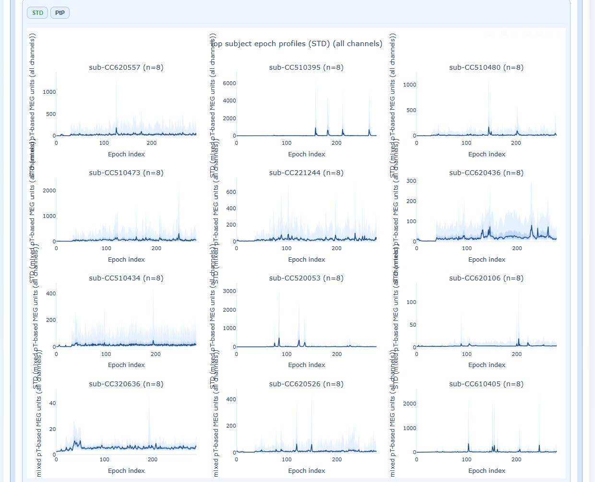
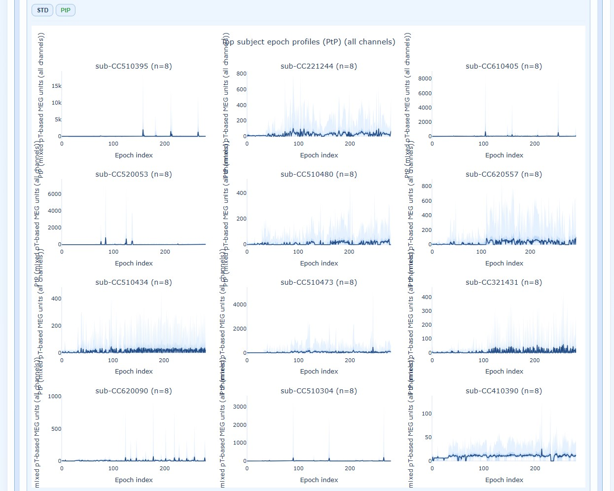

# QA Group Report

QA Group reports aggregate quality assessment metrics across all subjects in a single dataset. They help identify cohort-level patterns, outliers, and task-dependent quality shifts.

This section explains report structure and interpretation. For run commands and GUI clicks, use the [Tutorial](../book/tutorial.md).

The QA Group report uses a main two-level tab hierarchy and more optional:

| Hierarchy level | Content                                                                              |
|-----------------|--------------------------------------------------------------------------------------|
| Level 1         | Channel-type tabs: `Combined (MAG+GRAD)`, `MAG`, `GRAD`                              |
| Level 2         | Section subtabs (see below)                                                          |
| Level 3         | (Only for metrics) Metrics subtabs: `STD`, `PtP`, `PSD`...                           |
| Level 4+        | (Specific cases) measures (`Median`, `Mean`...) and figures (`Boxplot`, `Violin`...) |

## Header

The header of the report shows you a snapshot of the settings used for your QA group report. This is useful for documentation and reproducibility purposes, as you can always check which parameters were used to generate the report. Then, you can choose to show or hide the grids for all visualizations as well as the channel types. 


```{dropdown} Channel-types

- **`MAG`**: Magnetometer-specific analysis (units: pT)
- **`GRAD`**: Gradiometer-specific analysis (units: pT/cm)
- **`General`**: Pooled view across all channel types (use with caution due to unit mixing)

```


---

## Section 1: Summary Distributions

This section provides quick statistical overviews of each metric across all recordings. 

- **Violin plots:** Show full distribution shape for each metric
- **Box plots:** Highlight median, quartiles, and outliers
- **Individual points:** Each recording plotted for identification


As with many other figures, you can hover over individual points to see the subject/recording ID and exact metric value. You can also modify many visibility aspects such as the thickness of the violin and boxplot lines, the size of the individual points, the axis label and ticks fontsize and the displacement of the individual points to avoid overlap with the background elements.


### Pooled channel topomaps

You can see a `2D topomap` or a `3D topomap` of each metric averaged across all recordings and channels. This gives a quick overview of where quality issues tend to concentrate across the cohort. The `3D topomap` also has a **`Cap on`** mode to add a solid cap for improved visualization, and a **`Cap off`** mode to view the full sensor array without the cap. Additionally, you can click on legend items to show or hide specific lobes.


---

## Section 2: Cohort QA Overview

This section provides information regarding subjects' quality footprint across all metrics. It includes ranking, heatmap and epoch data.

### Subject Ranking Table

This table shows all subjects ranked by aggregated quality footprint. The higher the rank, the more quality issues that subject has across all metrics. This is a useful starting point to identify which subjects may need closer inspection in the QA Subject reports.


### Cohort Matrices

Two complementary heatmaps help you understand quality patterns at different levels of detail. As in other figures, you can hover over individual cells to see the subject/recording ID and exact metric value. You can also modify many visibility aspects such as the axis label and ticks fontsize.

````{tab-set}
```{tab-item} Recording-by-Metric Heatmap

Shows **every individual recording**, organized by subject/task/run. It identifies which specific recordings are problematic within a subject.

- **Rows** = each individual recording (multiple rows per subject if they have multiple runs)
- **Columns** = metric upper tail summaries (STD, PtP, PSD, etc.)
- **Color** = normalized burden across metrics (lighter = higher burden)

**Key features:**
- Color is robustly normalized for readability across mixed scales
- Hover reveals the raw value in metric units
- X-axis encodes QA metric summary
- Y-axis encodes Recordings (organized by subject / task / run)
- The color scale encodes Normalized value (robust z)
- In heatmaps, each cell is one channel-by-epoch value
- Vertical stripe patterns indicate simultaneous across-channel shifts by epoch
- Isolated horizontal structure indicates channel-specific burden
- This is a global pooled view: it summarizes the cohort footprint and should not be interpreted as subject identification
- This is a subject-aware view: it supports locating outlying subjects/recordings, but it does not by itself determine downstream handling


```

```{tab-item} Subject-by-Metric Heatmap

Shows **aggregated metrics per subject**, pooling all their recordings. It identifies which subjects are generally problematic across all their data, regardless of how many recordings they have.

- **Rows** = each subject (one row per subject, regardless of how many recordings they have)
- **Columns** = metric summaries (STD, PtP, PSD, etc.)
- **Color** = normalized burden per metric (allows cross-metric comparison; lighter = higher burden)

**Key features:**
- Color is normalized per metric to support cross-metric contrast
- Hover keeps raw summaries
- X-axis encodes Metric
- Y-axis encodes Subject
- The color scale encodes Normalized value (robust z)
- In heatmaps, each cell is one channel-by-epoch value
- Vertical stripe patterns indicate simultaneous across-channel shifts by epoch
- Isolated horizontal structure indicates channel-specific burden
- This is a global pooled view: it summarizes the cohort footprint and should not be interpreted as subject identification
- This is a subject-aware view: it supports locating outlying subjects/recordings, but it does not by itself determine downstream handling


```
````

### Top Subject Epoch Profiles

This section visualizes epoch-wise quality patterns for the highest-burden subjects, helping you identify **temporal trends** within individual subjects. Each panel represents one subject, ordered by overall burden (worst first).

````{tab-set}
```{tab-item} STD

Shows **epoch-wise STD values** across all channels in every epoch for the top-burden subjects.

**How to interpret:** Each panel is one subject, showing epoch-wise channel quantile bands for STD. Panels are ordered by subject upper-tail summary. 

- **X-axis** encodes Epoch index (every epoch is a number)
- **Y-axis** encodes STD (mixed pT-based MEG units (all channels))
- The central dark line represents the median STD across channels
- Shaded envelopes show the interquartile range (IQR) and 5-95% percentiles
- Widening bands reflect increased cross-channel variability
- STD summarizes channel variability amplitude per epoch
- Stable cohorts usually show gradual epoch trends
- Heavy upper tails indicate a subset of channels with larger variability
- This is a global pooled view: it summarizes the cohort footprint and should not be interpreted as subject identification
- This is a subject-aware view: it supports locating outlying subjects/recordings, but it does not by itself determine downstream handling

You can hover over the plot to see the exact STD values for each epoch. You can also modify visibility aspects such as axis label and tick fontsize, and line width to suit your needs.



```

```{tab-item} PtP

Shows **epoch-wise peak-to-peak amplitude** across all channels in every epoch for the top-burden subjects.

**How to interpret:** Each panel is one subject, showing epoch-wise channel quantile bands for PtP. Panels are ordered by subject upper-tail summary.

- **X-axis** encodes Epoch index (every epoch is a number)
- **Y-axis** encodes PtP (mixed pT-based MEG units (all channels))
- The central dark line represents the median PtP across channels
- Shaded envelopes show the interquartile range (IQR) and 5-95% percentiles
- Widening bands reflect increased cross-channel variability
- PtP summarizes excursion amplitude
- A heavy upper tail indicates channels with larger peak-to-peak bursts than the cohort median
- This is a global pooled view: it summarizes the cohort footprint and should not be interpreted as subject identification
- This is a subject-aware view: it supports locating outlying subjects/recordings, but it does not by itself determine downstream handling

You can hover over the plot to see the exact PtP values for each epoch. You can also modify visibility aspects such as axis label and tick fontsize, and line width to suit your needs.



```
````

---

## Section 3: QA Metrics Across Tasks

This section reveals how quality varies by task or experimental condition for every subject. It may help you identify task-specific quality issues or artifacts that only appear in certain conditions.

The x-axis shows the different tasks/conditions, while the y-axis shows the metric value (e.g., STD, PtP, etc.). Each line represents one subject, allowing you to see how their quality metrics change across tasks. You can hover over each line to see the subject ID and exact metric values for each task. The black line of every plot shows the cohort median profile across subjects. In every metric subtab you can choose to show the `Median`, the `Mean` or the `Upper Tail` (95th percentile) of the metric distribution across channels. Every figure has a "How to interpret" section that explains how to read the plots and what patterns to look for.


---

## Section 4: QA Metrics Details

This section provides deep-dive visualizations for each metric. All metrics follow a consistent structure with three main panel types (A, B, C) and share common visualization features.

### Understanding Panel Types and Summary Definitions

Each metric is visualized through three complementary panel perspectives, each revealing different aggregation dimensions:

**Panel A - Recording Distributions:**
- **Median:** `median_c(median_t STD[c,t])`  
- **Mean:** `mean_c(mean_t STD[c,t])`  
- **Upper Tail:** `q95_c(q95_t STD[c,t])`  
- **Data counts:** N subjects=654, N runs=2577, N recording values=5154, N channels=788562, N epochs=581528

**Panel B - Epochs per Channel:**
- **Median:** `median_t STD[c,t]` per channel c  
- **Mean:** `mean_t STD[c,t]` per channel c  
- **Upper Tail:** `q95_t STD[c,t]` per channel c  
- **Data counts:** N subjects=654, N runs=2577, N recording values=5154, N channels=788562, N epochs=581528

**Panel C - Channels per Epoch:**
- **Median:** `median_c STD[c,t]` per epoch t  
- **Mean:** `mean_c STD[c,t]` per epoch t  
- **Upper Tail:** `q95_c STD[c,t]` per epoch t  
- **Data counts:** N subjects=654, N runs=2577, N recording values=5154, N channels=788562, N epochs=581528

### How to Read All Metric Visualizations

Before diving into specific metrics, understand the universal features shared across all visualizations:

#### 1. **Measures Available**

- **`Median`:** Central tendency measure
- **`Mean`:** Arithmetic average
- **`Upper Tail`:** 95th percentile, capturing high-burden outliers

#### 2. **Data Modes**

Each plot can display either:
- **`Raw`:** Original units (e.g., pT for STD, pT/cm for GRAD)
- **`Normalized`:** Median/IQR robust scaling to improve comparability of shape across conditions without changing rank structure

#### 3. **Panel Structure**

Each metric provides three complementary panel views with the same boxplot/violin/histogram/density format, but revealing different aggregation levels:

- **Panel A:** Recording distribution (across all recordings)
- **Panel B:** Epochs per channel (temporal patterns within each channel)
- **Panel C:** Channels per epoch (spatial patterns within each epoch)

#### 4. **Plot Types**

**Boxplot:** 
- **How to interpret:** Each box summarizes the pooled empirical spread for the selected group (median, quartiles, and whiskers). Jittered dots show one robust value per subject for the selected median summary (median over available runs).
- **Units:** STD (mixed pT-based MEG units (all channels))
- **X-axis:** Task / condition
- **Y-axis:** STD (mixed pT-based MEG units (all channels))
- **What to look for:** In scatter views, each point is one recording-level summary. Outlying points indicate recordings with atypical metric combinations relative to the cohort cloud. Outliers may warrant further investigation.
- **Interpretation:** STD summarizes channel variability amplitude per epoch; stable cohorts usually show gradual epoch trends, while heavy upper tails indicate a subset of channels with larger variability. The normalized view applies a robust scaling (median/IQR) to improve comparability of shape across conditions without changing rank structure.

**Violin:**
- **How to interpret:** Density-smoothed violin variant of the same values. Jittered dots show one robust value per subject for the selected median summary.
- **Units:** STD (mixed pT-based MEG units (all channels))
- **X-axis:** Task / condition
- **Y-axis:** STD (mixed pT-based MEG units (all channels))
- **What to look for:** In violin views, each violin is a full empirical distribution; violin width reflects density, and jittered points represent recording-level values. Hover over points to see subject identity.
- **Interpretation:** STD summarizes channel variability amplitude per epoch; stable cohorts usually show gradual epoch trends, while heavy upper tails indicate a subset of channels with larger variability. The normalized view applies a robust scaling (median/IQR) to improve comparability of shape across conditions without changing rank structure.

**Histogram:**
- **How to interpret:** Histogram variant of the same summary values showing frequency distributions.
- **Units:** STD (mixed pT-based MEG units (all channels))
- **X-axis:** STD (mixed pT-based MEG units (all channels))
- **Y-axis:** Density
- **What to look for:** In histogram views, bars show probability density and the smooth overlaid curve is a kernel density estimate of the same observations. Look for multimodal distributions or long tails.
- **Interpretation:** STD summarizes channel variability amplitude per epoch; stable cohorts usually show gradual epoch trends, while heavy upper tails indicate a subset of channels with larger variability. The normalized view applies a robust scaling (median/IQR) to improve comparability of shape across conditions without changing rank structure.

**Density:**
- **How to interpret:** Kernel-density variant of the same summary values showing smooth probability density.
- **Units:** STD (mixed pT-based MEG units (all channels))
- **X-axis:** STD (mixed pT-based MEG units (all channels))
- **Y-axis:** Density
- **What to look for:** In density views, each line or curve represents a smoothed distribution. Look for skewness, multimodality, or heavy tails.
- **Interpretation:** STD summarizes channel variability amplitude per epoch; stable cohorts usually show gradual epoch trends, while heavy upper tails indicate a subset of channels with larger variability. The normalized view applies a robust scaling (median/IQR) to improve comparability of shape across conditions without changing rank structure.

#### 5. **Interactive Features**

All visualizations support:

- **Reveal on Hover:** Hover to see subject ID, recording ID, exact metric value, and task/condition
- **Zoom:** Click and drag to focus on a region; double-click to reset
- **Line/point size adjustment:** Modify line thickness, point size, and label/tick fontsize for clarity
- **Point displacement level:** Adjust displacement to avoid overlapping points
- **Axis label and tick fontsize:** Customize text size for readability
- **Export:** Save individual plots as PNG

#### 6. **Special Plotting Features**

Some figures include additional interactive options:
- **Cap on / Cap off:** For topomap visualizations, toggle a 3D cap to enhance visualization
- **Lobe legend:** Click on legend items to show or hide specific lobes (color-coded regions) in plots with anatomical lobes

---

### Available Views per Metric

| Metric | Views |
|--------|-------|
| **STD** | Distributions (Panels A/B/C), fingerprint scatters, channel×epoch heatmaps, topomaps |
| **PtP** | Distributions (Panels A/B/C), fingerprint scatters, channel×epoch heatmaps, topomaps |
| **PSD** | Frequency burden distributions (Panels A/B/C), mains ratio distributions, topomaps |
| **ECG/EOG** | Correlation burden distributions (Panels A/B/C), topomaps |
| **Muscle** | Event burden distributions (Panels A/B/C) |

### Channel×Epoch Heatmaps


These heatmaps aggregate channel×epoch patterns across subjects:
- Rows = channels, columns = epochs
- Color = metric value
- Top profile = epoch summary, right profile = channel summary

### Pooled Topomaps


Sensor-space visualizations showing where quality issues concentrate:
- 2D flat topomaps for quick viewing
- 3D interactive topomaps for detailed exploration
- **Cap on / Cap off:** Toggle between views with or without a 3D cap overlay
- **Lobe legend:** Click legend items to show/hide color-coded lobes


### PSD Frequency Views


Show spectral patterns across the cohort:
- Mains frequency burden
- Harmonic patterns
- Broadband contamination

---

## Section 5: Cumulative Distributions

Statistical appendix with empirical cumulative distribution functions (ECDFs).


**How to use:**
- Compare distribution tails across metrics
- Identify what percentage of recordings exceed specific thresholds
- Support threshold selection for QC decisions


---

## Practical Reading Order

1. **Start in Summary Distributions** → Get quick overview of metric spreads
2. **Move to Cohort QA Overview** → Identify outlier subjects/recordings
3. **Check QA Metrics Across Tasks** → Test for task-dependent patterns
4. **Use QA Metrics Details** → Explain observed outliers with detailed views
5. **Use Cumulative Distributions** → Support threshold decisions

## Tips for Effective Use

- **Always compare MAG and GRAD tabs** when investigating issues
- **Use hover information** to identify specific subjects/recordings
- **Cross-reference with QA Subject reports** for detailed inspection of flagged recordings
- **Document findings** before proceeding to QC Group analysis

