# QA Subject Reports

QA Subject reports shows the full quality profile of one subject across runs and tasks. Useful to isolated quality assessments.

```{admonition} Report Overview
:class: tip
This section explains report structure and interpretation. For run commands and GUI clicks, use the [Tutorial](./tutorial.md). 
```


## Overview tab (what to inspect first)

1. **Subject summary**
It includes basic metadata, such as the name of the dataset, subject ID, number of runs and the number of metrics computed by MEGqc.

2. **Run × metric availability table**
Confirms which metrics were computed for each run/task.

3. **Recording header information**
Metadata from the original raw files, divided by run/task. This includes some general information (such as acquisition date and experimenter), as well as channel information (such as good, bad channels, ECG/EOG channel name) and recording properties (such as sampling frequency and hardware filters). 


### Sensor positions (3D, one panel per run)
Visual representation of MEG sensor geometry on the head model.
* Sensors are color-coded by lobe grouping. The same color convention is reused across multiple plots.
* There are head models for every task/run.
* You can also see the `tsv` source file paths for these plots by clicking on _"Sources"_.

You can interact with the 3D scene to explore sensor locations and their lobe groupings:
1. Click-and-drag to rotate the head model. You can also zoom in and out using the scroll wheel.


2. Click legend items to toggle lobe groups (e.g., click "Left Frontal" to hide/show frontal sensors).


```{admonition} Sensor labels
:class: tip

* Magnetometers names end with '1' like 'MEG0111'.
* Gradiometers names end with '2' and '3' like 'MEG0112', 'MEG0113'.

```

Across the visualizations of the different metrics, you can interact with the figures in many way:

- **Topoplots (3D):** when available, use `Cap: ON`  to add a solid cap representation of the head, which can help to contextualize sensor locations and their variability patterns.
- **Color-coded lobe plots:** click a legend item once to hide/show that lobe group, or double-click to isolate one lobe group.


## Metric tabs


```{admonition} Metric tabs
:class: dropdown

Every scope section contains an explication of the same metrics. The exact visualizations and interpretations may differ, but the general structure is consistent. Use the right side menu to navigate to the metric of interest.

Each metric tab follows this pattern:

- run/task subtabs _(e.g., deduction and induction)_ 
- channel-type subtabs (`MAG`, `GRAD`, optionally `General`),
- plot subtabs for that metric _(e.g., Channel-wise STD topomap (3D))_. 

```

## Standard Deviation (STD) tab
This metric shows different views on channel variability, which allows you to identify noisy and flat channels and temporal non-stationarities.

### 1) Channel-wise STD topomap (3D)
This plot shows the spatial distribution of channel variability across the head. Sensors are color-coded by their STD values (with a colorbar indicating the range). This allows you to quickly identify hot areas of sensor burden or isolated islands.
You can interact with the 3D scene as in the Overview tab: You can rotate the head to see sensors from different angles, by clicking and dragging the mouse. You can also zoom in and out using the scroll wheel. Names and STD values appear on hover.

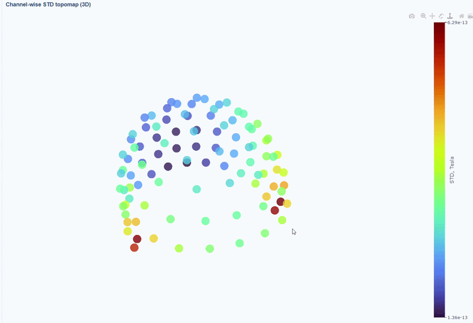


### 2) Channel-wise STD distribution
This plot shows the distribution of STD values across channels. The shape of the distribution can reveal whether variability is widespread or concentrated in a few channels.
* Every dot represents one channel, you can see the name and STD value on hover _(e.g., MEG0211: 4.37e-13)_. The x-axis shows you the range of STD values in Tesla, extreme left-values (close to zero) indicate flat channels, while extreme right-values indicate highly variable channels. The position on the Y-axis do not hold information. The channels dot are color-coded by lobe group.

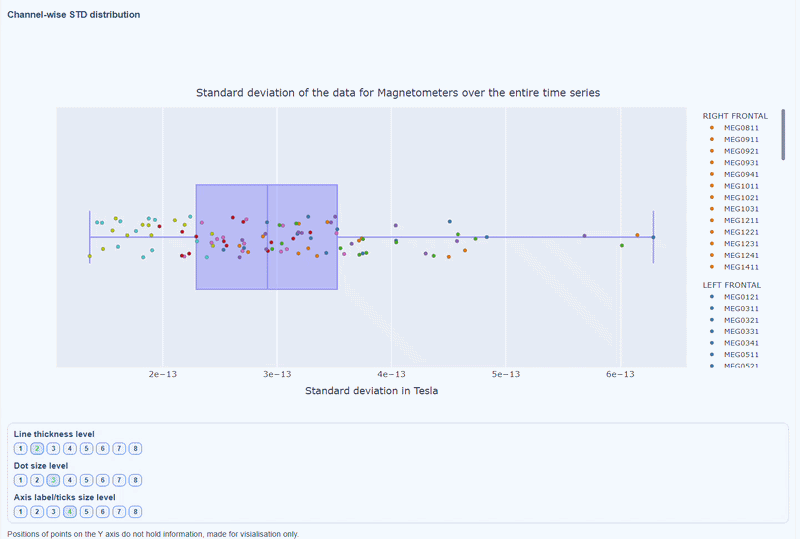

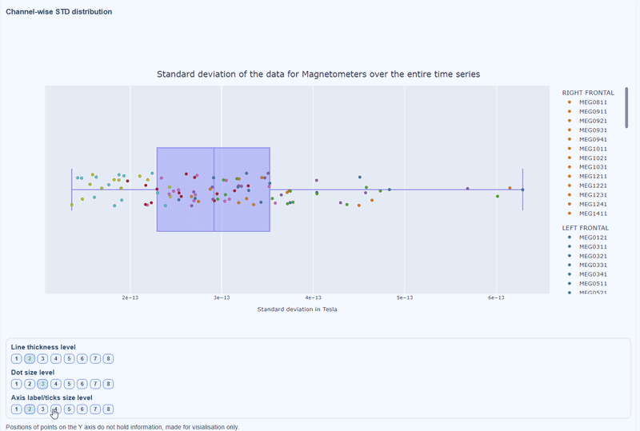

* You can also use the menu below to increase the thickness of the boxplot, the size of the dot and the textsize of the axis labels, to make it easier to read.

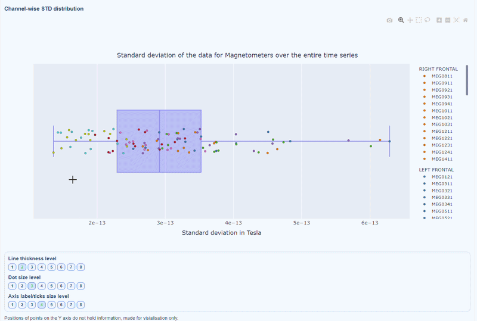
 
### 3) Channel × epoch heatmap
This plot shows the STD values for each channel (y-axis) across epochs (x-axis).
* The color of each cell indicates the STD value for that channel in that epoch, with a colorbar showing the range. This allows you to identify temporal patterns of variability, such as transient bursts (vertical bands) or persistent channel issues (horizontal bands).

* The top profile shows the average STD across channels for each epoch, which can reveal epochs with overall high variability. The right profile shows the average STD across epochs for each channel, which can highlight channels with consistently high variability.

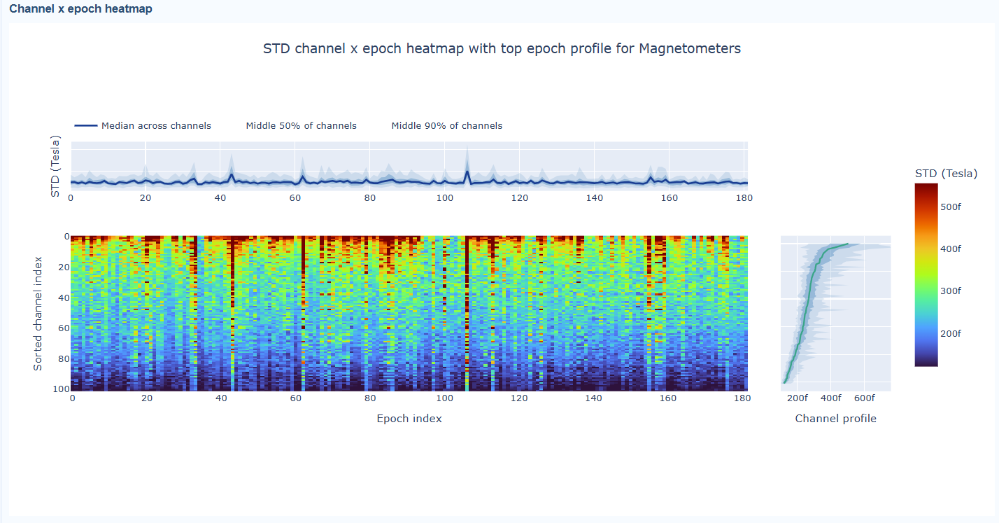

* You can also use the menu below to choose between plotting the median, the mean or the upper tail (75th percentile) in the top profile, to better capture different types of epoch-level or channel-level burden.

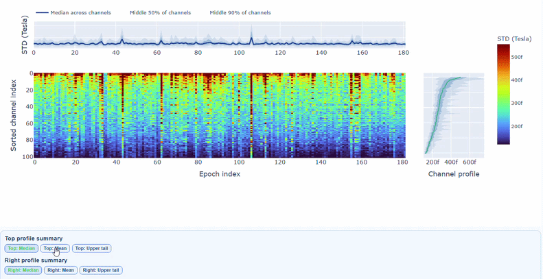


* You can also use the menu below to increase the line thickness and text size of the heatmap and profiles, to make it easier to read.

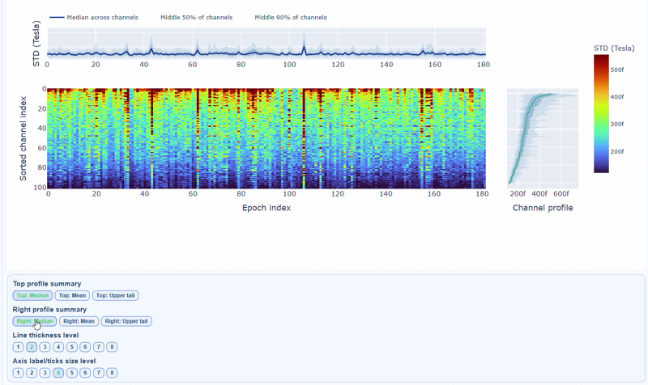

* Channels repeatedly high in the right profile are candidates for bad-channel labeling, while isolated epoch spikes in the top profile suggest selective epoch rejection. Mixed patterns should be cross-checked with PtP and PSD before hard exclusion.


## Peak-to-Peak (PtP) tab
This metric shows different excursion amplitude views, to locate transient bursts and outlier excursions. It is calculated as the difference between the maximum and minimum signal values within an epoch for each channel, `max(signal) - min(signal)`. The visualizations in the PtP tab are similar to those in the STD tab, but they focus on excursion amplitudes rather than variability.

### 1) Channel-wise PtP topomap (3D)
* Each dot represents a sensor, and its color indicates the PtP value, the colorbar shows the range of PtP values in Tesla. This allows you to identify sensors with high excursion amplitudes, which may indicate transient artifacts or outlier events.

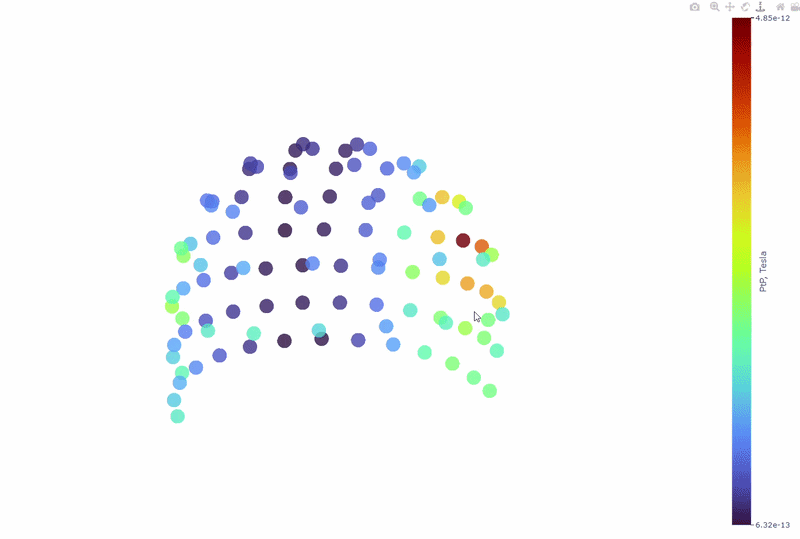

### 2) Channel-wise PtP distribution
* The boxplot shows the distribution of PtP values across channels. Each dot represents a channel, and its color indicates the lobe group. The x-axis shows the range of PtP values in Tesla, with extreme right-values indicating channels with high excursion amplitudes. The position on the Y-axis does not hold information. On hover, you can see the channel name and PtP value (e.g., MEG0211: 4.37e-13). 

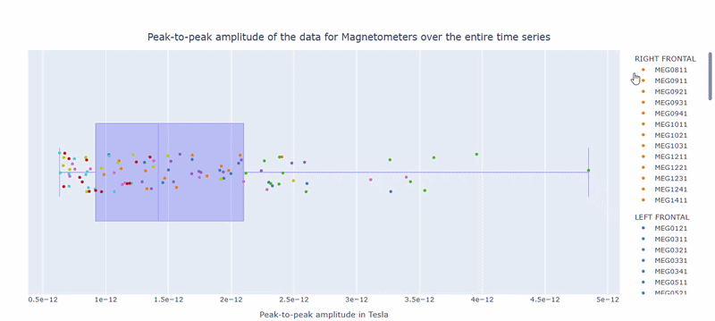


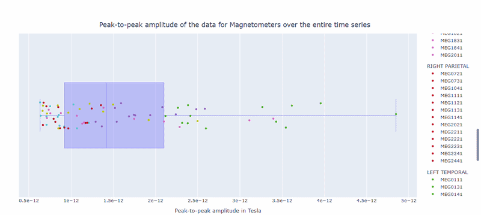

### 3) Channel × epoch heatmap
* This plot shows the PtP values for each channel across epochs, with the color of each cell indicating the PtP value for that channel in that epoch, and a colorbar showing the range. This allows you to identify temporal patterns of high excursion amplitudes, such as transient bursts (vertical bands) or persistent channel issues (horizontal bands).

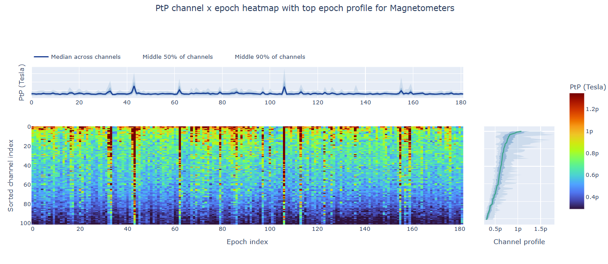

* The top profile shows the average PtP across channels for each epoch, which can reveal epochs with overall high excursion amplitudes. The right profile shows the average PtP across epochs for each channel, which can highlight channels with consistently high excursion amplitudes. You can choose (with the menu below) to plot the median, the mean or the upper tail (75th percentile), to better capture different types of epoch-level or channel-level burden.

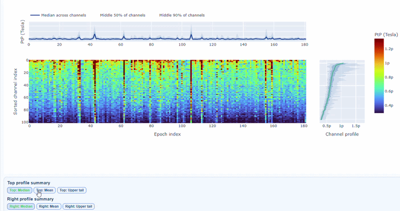

* You can also use the menu below to increase the line thickness and text size of the heatmap and profiles, to make it easier to read.


* Persistently high PtP values are bad-channel candidates, sparse high-PtP epochs can be rejected selectively. Mixed patterns should be cross-checked with STD and PSD before hard exclusion.

### PtP (auto) and PtP (manual) subtabs
The `PtP (auto)` subtab shows the PtP values calculated using the MNE-based automatic epoching method, while the `PtP (manual)` values are calculated using MEGqc internal PtP pathway and thresholds.


## Power Spectral Density (PSD) tab
Power spectral density (PSD) characterize frequency-domain burden and are used to detect narrowband interference (for example mains harmonics) and broad-band contamination. The same spectral analysis applies to both MAG and GRAD channels. Common interference sources (power line harmonics, environmental noise) typically affect both channel types similarly.

### 1) Signal-to-noise ratio (SNR) all channels
Useful for quick triage before detailed spectrum inspection. High noise indicates a strong narrowband contamination burden. For example, line noise at 50Hz and its harmonics (100Hz, 150Hz).

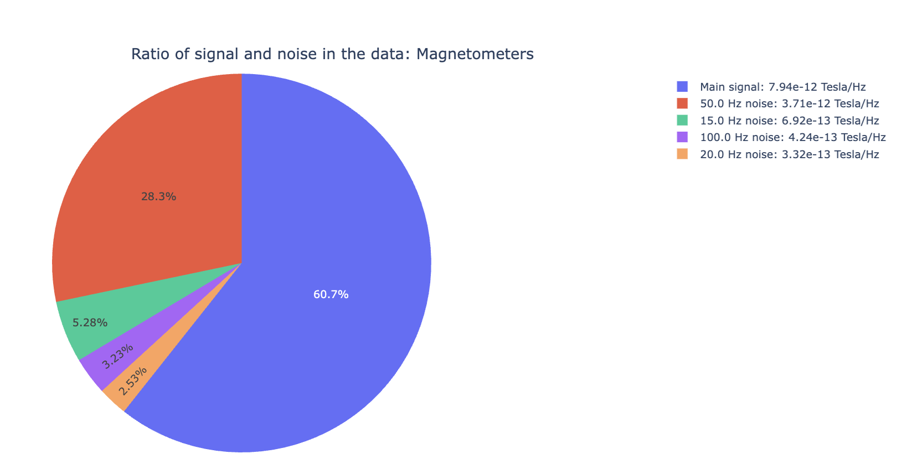

### 2) PSD curves by channel
* It shows the Welch PSD curves for all channels. high global noisy-frequency count suggests global filtering/interference. Always interpret with task context and raw spectra.
* Every channel line is color coded by lobe group. You can also click and drag to zoom in on specific frequency ranges.
* On hover you can see the channel name and the PSD value at that frequency (e.g., MEG0211: 1.2e-13 at 50Hz). This allows you to identify channels with high power in specific frequency bands.

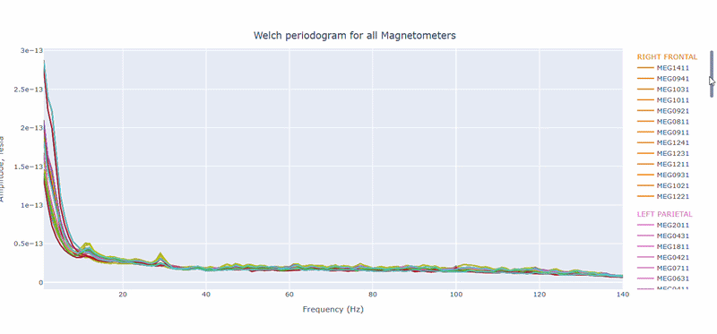

* You can choose wether to plot in linear values or in logarithmic (dB) scale, which can help to better visualize differences in power across channels and frequencies.
* You can as well increase the text size of the axis labels and the legend, to make it easier to read.

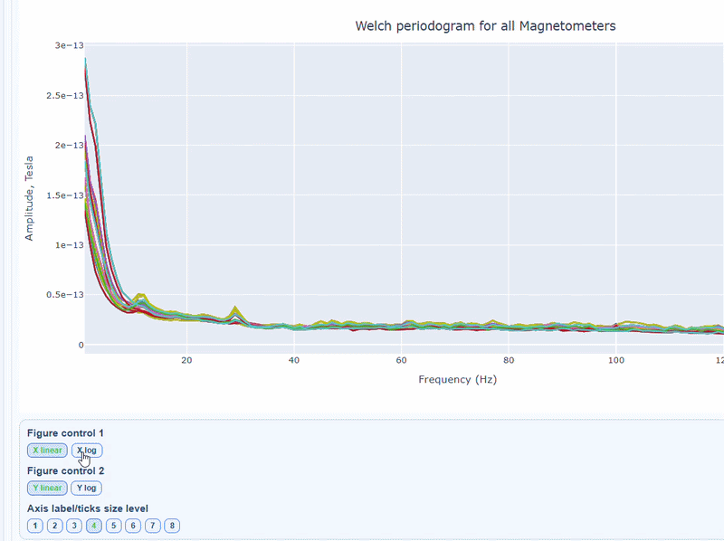

* Narrow tall peaks indicate fixed frequencies contamination and broad elevation across suggests movement-related effects. Channel-specific peaks suggest localized hardware issues. 

### 3) Channel-wise PSD topomap (3D)
It reveals the spatial concetration of spectral contamination. You can rotate the figure and hover over sensors to see their names and PSD values at specific frequencies.

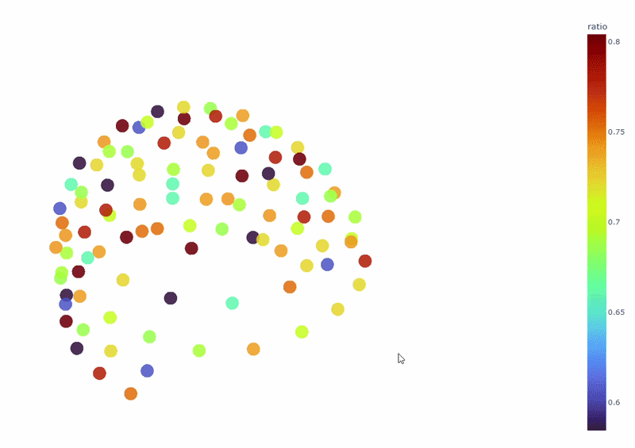

### 4) PSD Relative band amplitude all channels

This plot shows the relative amplitude of specific frequency bands (e.g., alpha, beta) contributions in all channels. It reveals dominant frequency content profile.

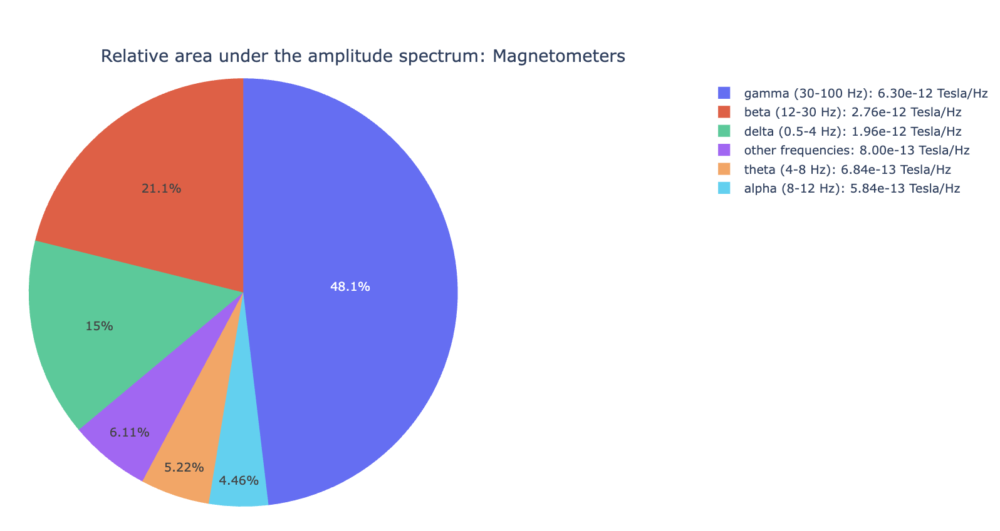


## Electrocardiogram (ECG) tab
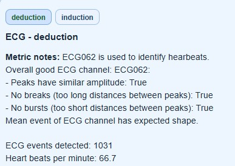
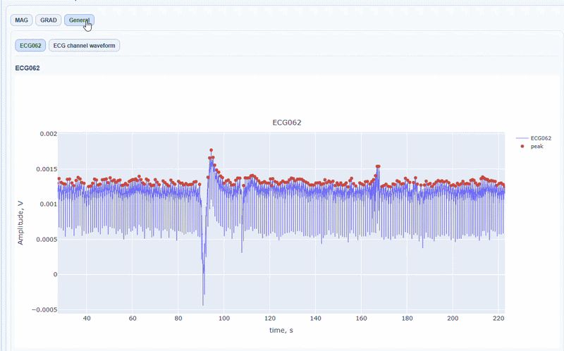
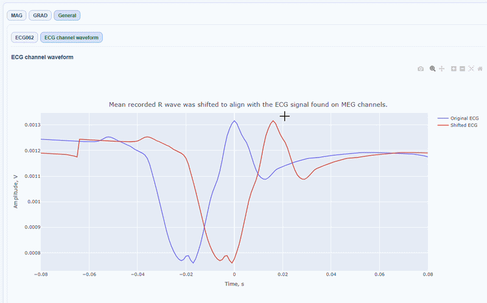

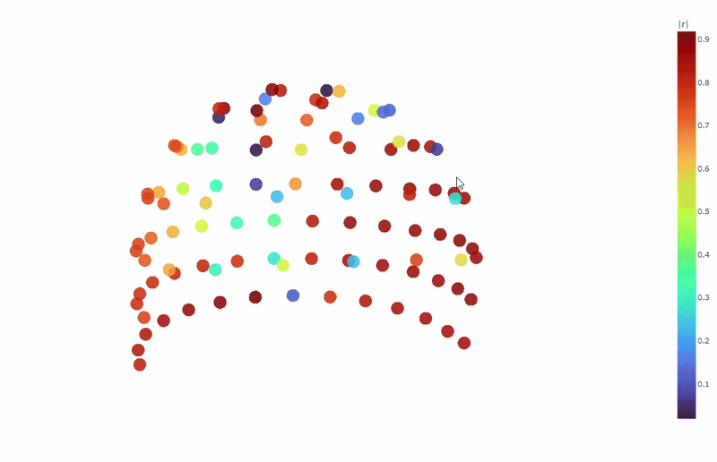
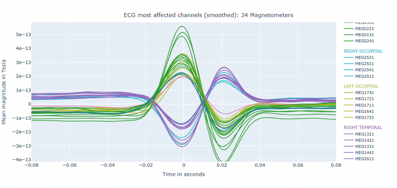
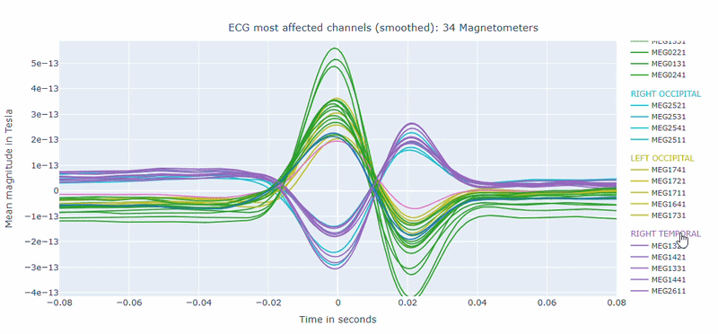


## Electrooculography (EOG) tab
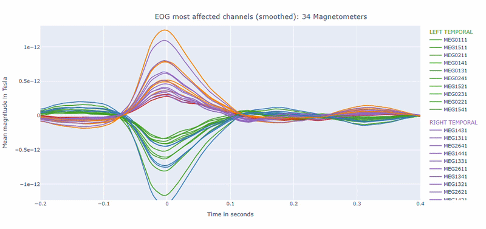
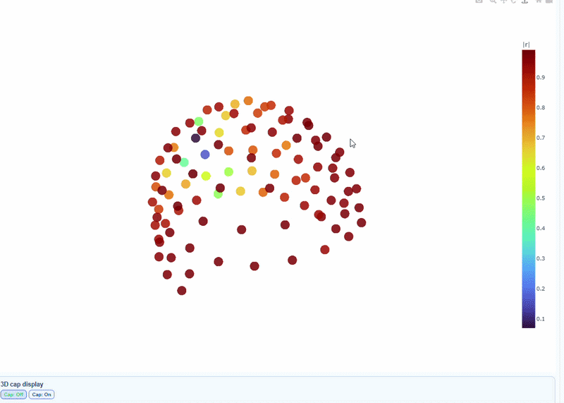
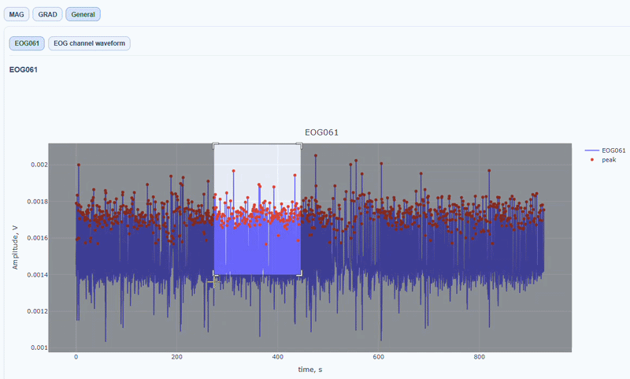
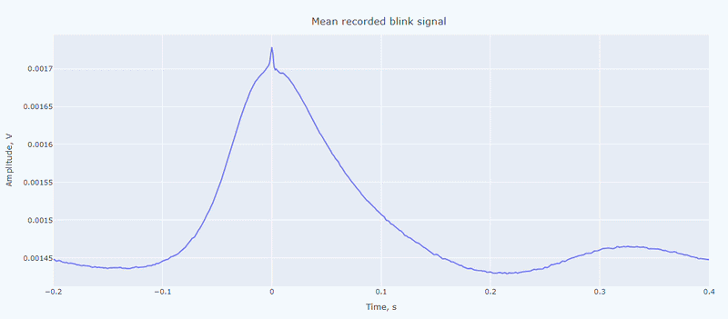


## Muscle tab

## Head tab

## Stimulus tab

## QC summary tab (what it contains)


<!--

| Top tab | What it contains | Why it matters |
|---|---|---|
| `Overview` | run/metric availability table, sensor geometry, per-run raw info | validates completeness and data context |
| Metric tabs (`STD`, `PtP`, `PSD`, `ECG`, `EOG`, `Muscle`, `Head`, `Stimulus`) | run-specific QA visualizations | localizes quality issues in time, frequency, and sensor space |
| `QC summary` | metric-specific summary text and SimpleMetrics tables; GQI attempt rows | auditable QC-relevant descriptors by run/task |


- [STD](metrics/std.md)
- [PtP](metrics/ptp.md)
- [PSD](metrics/psd.md)
- [ECG](metrics/ecg.md)
- [EOG](metrics/eog.md)
- [Muscle](metrics/muscle.md)
- [Head](metrics/head.md)
- [Stimulus](metrics/stim.md)

## QC summary tab (detailed behavior)

`QC summary` is metric-oriented and currently exposes metric tabs including `GQI`, `PSD`, `ECG`, `EOG`, `STD`, `PtP (manual)`, `PtP (auto)`, `Muscle`, `Head`, `Stimulus`, and `INITIAL_INFO` (when available in summary JSON).

### GQI subtab

For the current subject, GQI rows are collected from attempt files:

- `summary_reports/group_metrics/Global_Quality_Index_attempt_<n>.tsv`

Rows are filtered by subject and shown by task and attempt.

### Metric subtabs (PSD/ECG/EOG/STD/PtP/...)

For each run/task subtab:

1. **Report summary text** (from report strings JSON),
2. **Metric-specific compact summary** (for PSD and ECG/EOG),
3. **SimpleMetrics details table** preserving nested structures,
4. **Derivative source list** with exact file paths.

This design allows quick reading first, then auditable deep inspection.

The QC summary tab is essential for understanding the automated quality assessment results and tracking how GQI scores were computed for each run.

-->
